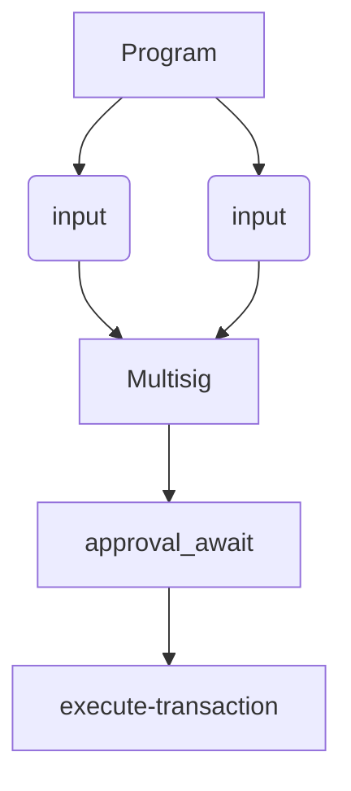

## Solana Multisig

Exampler Multisig to execute groundless Solana transactions.

```mermaid
graph TD;
    Program-->Owner(input);
    Program-->Threshold(input);
    Owner(input)-->Multisig;
    Threshold(input)-->Multisig;
    Multisig-->approval_await;
    approval_await-->execute-transaction;
```