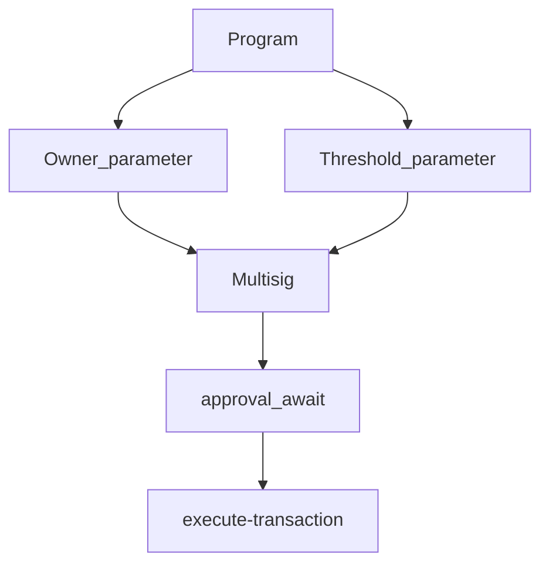

## Solana Multisig


Exampler Multisig to execute groundless Solana transactions.

This program allows you to conduct a multisignature transaction via a BPF program generated my the solana-multisig program. 





### Parameters
1. Owners: Adresses of the owners to conductthe transactions
2. Threshold: Number of signatures (signers) required to sign to execute the transaction.

Threshold < Owners

## Build

```anchor build --verifiable```


## Test

``` anchor test```